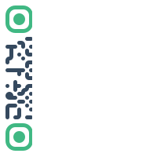
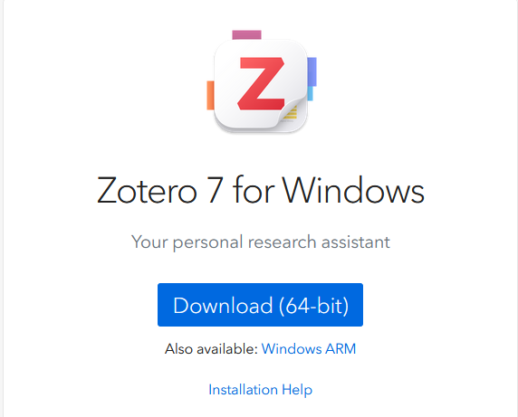
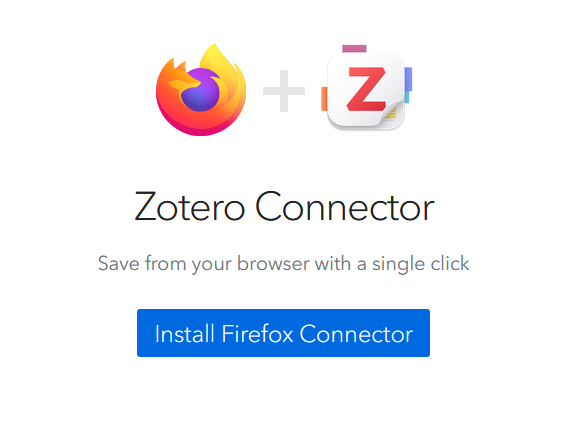
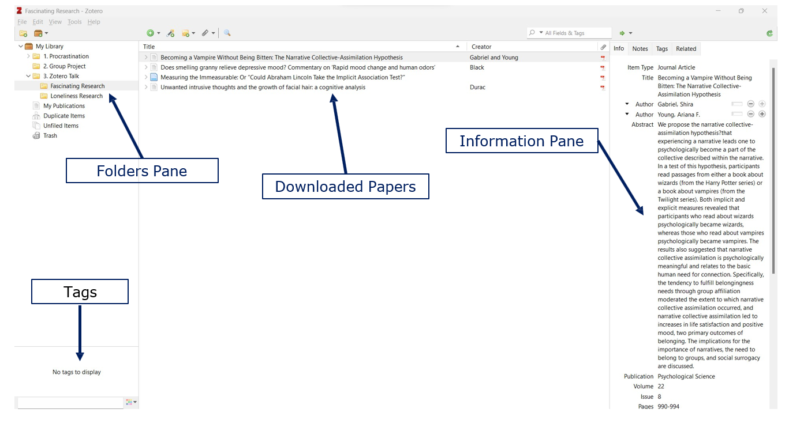
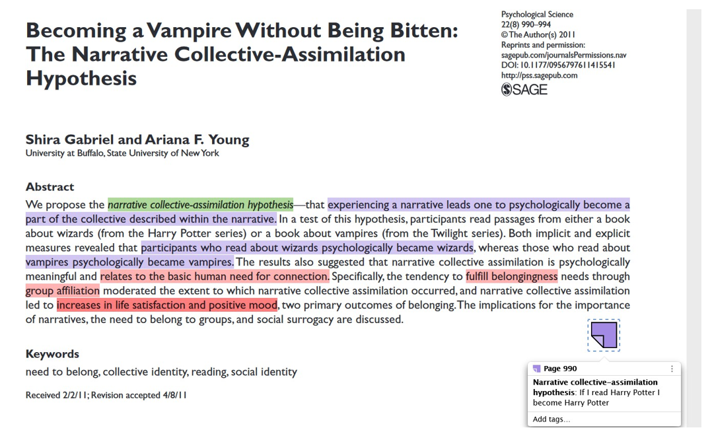

```{r setup, include=FALSE}
knitr::opts_chunk$set(
  warning = FALSE, message = FALSE,
  fig.retina = 3, fig.align = "center")

xaringanExtra::use_tile_view()
xaringanExtra::use_panelset()
```

class: center middle main-title section-title-4

#  Managing Literature<br>Zotero<br>(and other cool stuff)

.class-info[.light[Cormac Monaghan]]

---

name: qr-code
class: title title-inv-4

# Follow along

.center[
<figure>
 
 </figure>
]

---

name: outline
class: title title-inv-4

# Plan for Today

--

.box-1.medium.sp-after-half[What is Zotero]

--

.box-2.medium.sp-after-half[Installing and using Zotero]

--

.box-5.medium.sp-after-half[Live demonstration]

--

.box-4.medium.sp-after-half[Some other cool stuff]

---

layout: false
name: what-are-managers
class: center middle section-title section-title-6 animated fadeIn

# What are reference managers

---

.center[
<figure>
 
 </figure>
]

???

Have you ever started an assignment, opened Google Scholar, and suddenly realise you are drowning in a mountain of papers. You have 20 tabs open, 5 PDFs downloaded, and you are not sure which paper is which. 

---

.center[
<figure>
 
 </figure>
]

???

Or you have a home screen that looks like this

---

layout: true
class: title title-6

---

# Reference Managers

.box-inv-1.medium[Store, organise, and export your citations]

--

.box-inv-5.medium[Highlight key text and take notes]

--

.box-inv-7.medium[Automatically create reference list]

--

.pull-left-3[
<figure>
 
 </figure>
]

--

.pull-right-3[
<figure>
 
 </figure>
]

---

layout: false
name: what-is-zotero
class: center middle section-title section-title-4 animated fadeIn

# What is Zotero

---

layout: true
class: title title-4

---

# Zotero

.box-inv-4[Zotero is a **free** and **open-access** reference management tool that aids you in collecting, organizing, citing, <br>and sharing your research sources]

--

<br>

.box-inv-4[Save references from databases,  libraries, and the internet]

--

.box-inv-4[Write notes and comments and attach them to papers ]

--

.box-inv-4[Generate citations and reference lists]

---

layout: true
class: title title-2

---

# Installing Zotero

.box-inv-2[Zotero can be installed on all major operating systems via the [following link](https://www.zotero.org/download/)]

<br>

.center[
<figure>
 
 </figure>
]

---

# Zotero Browser Extension

.box-inv-2[For most internet browsers you can also install the <br>**Zotero Connector**]

<br>

.center[
<figure>
 
 </figure>
]

---

# The Zotero Software

.center[
<figure>
 
 </figure>
]

---

# The Zotero Software

.center[
<figure>
 
 </figure>
]

---

# Adding papers to Zotero

.box-2[I do not recommend these]

.box-inv-2[Manually adding in the details – **too much hassle**]

.box-inv-2[Searching via DOI or URL]

--

<br>

.box-2[I recommend these]

.box-inv-2[Downloading and copying the paper]

.box-inv-2[Using the Zotero Connector]

---

layout: false
name: live-demo
class: center middle section-title section-title-5 animated fadeIn

# Live demo

---

layout: false
name: other-stuff
class: center middle section-title section-title-1 animated fadeIn

# Other cool stuff

---

layout: true
class: title title-inv-1

---

# Other cool stuff

.box-inv-1.medium.sp-after-half[[Connected Papers](https://www.connectedpapers.com/)]

.box-inv-1.medium.sp-after-half[[Semantic Scholar](https://www.semanticscholar.org/)]

.box-inv-1.medium.sp-after-half[[Unpaywall](https://unpaywall.org/)]

<br>

.box-1.medium.sp-after-half[SciHub]